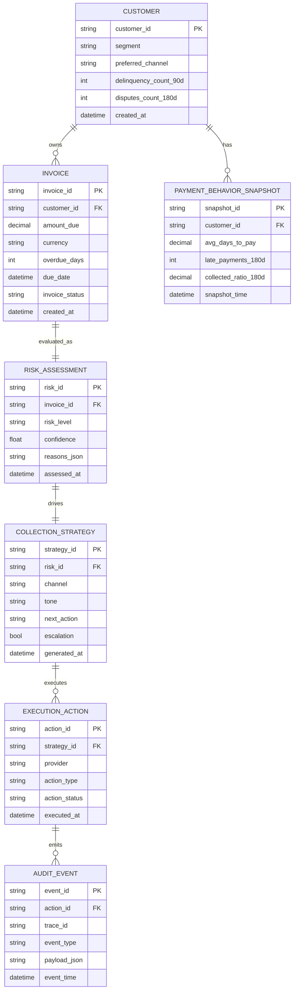

# ERD.md — Intelligent Billing Operations Engine (MVP)

## 1. 实体关系图（Mermaid）

## 2. 关系说明

- 一个 `CUSTOMER` 可拥有多张 `INVOICE`。
- 每张 `INVOICE` 在一次流程中对应一个 `RISK_ASSESSMENT`。
- 每个 `RISK_ASSESSMENT` 生成一个 `COLLECTION_STRATEGY`。
- 一个策略可触发多个 `EXECUTION_ACTION`（例如重试、升级动作）。
- 每个执行动作会产生多个 `AUDIT_EVENT` 用于追踪和审计。

## 3. 关键字段约束

- `risk_level`：`low | medium | high`
- `confidence`：`0.0 - 1.0`
- `action_status`：`queued | sent | failed | skipped`
- `event_type`：`decision | execution | fallback | error`

## 4. 审计最小必填字段

每条 `AUDIT_EVENT.payload_json` 至少包含：
- `invoice_id`
- `customer_id`
- `risk_level`
- `reasons`
- `next_action`
- `status`

## 5. MVP 实现建议

- 数据层先用 JSON/内存对象模拟，保持与该 ERD 字段一致。
- 正式接入数据库时，优先落地：
  - `invoice`
  - `risk_assessment`
  - `collection_strategy`
  - `audit_event`